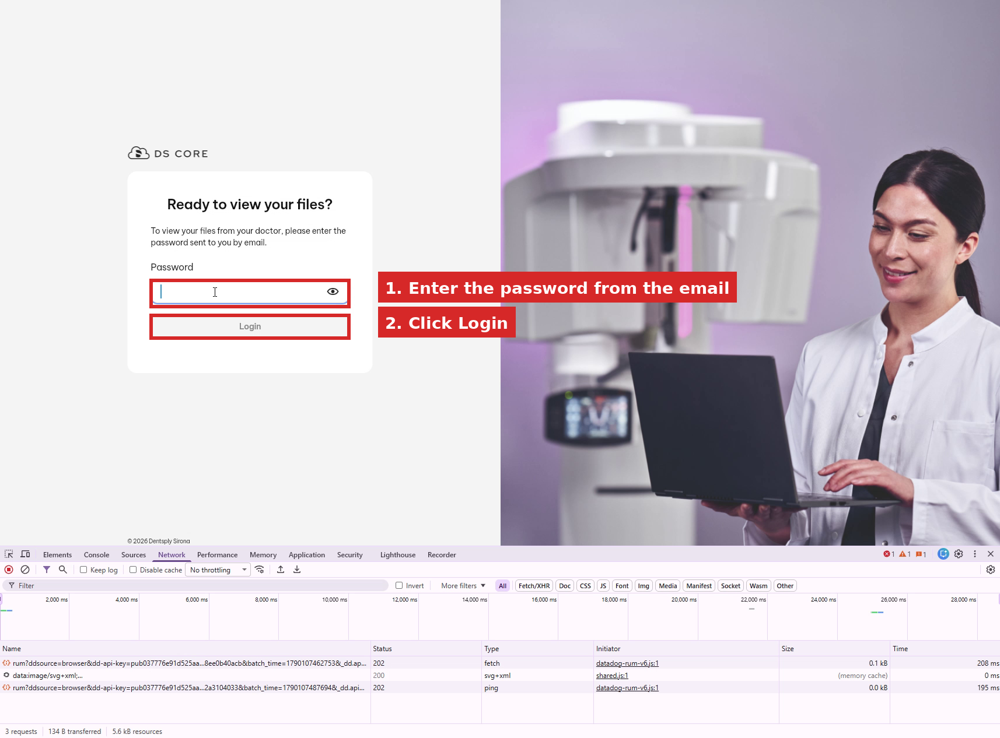
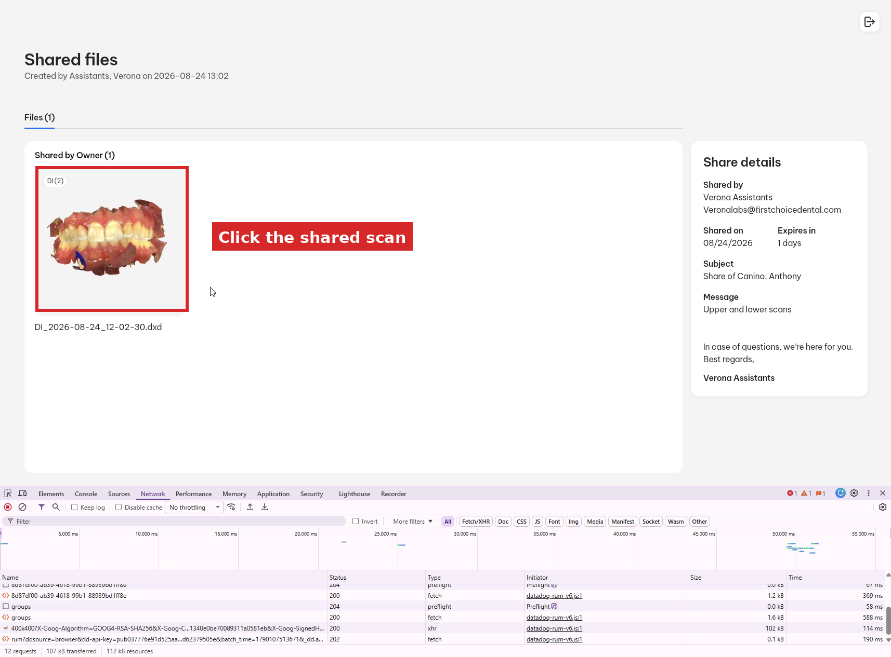
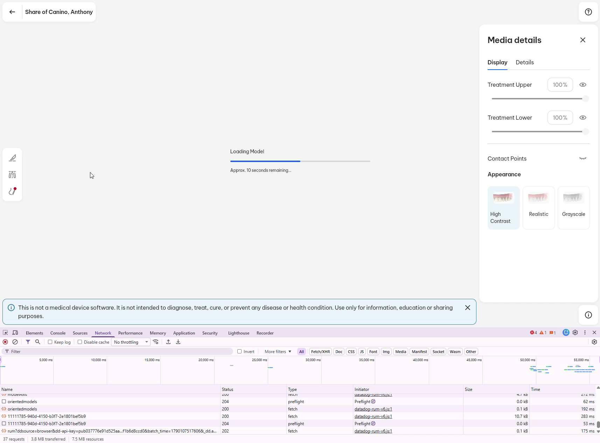
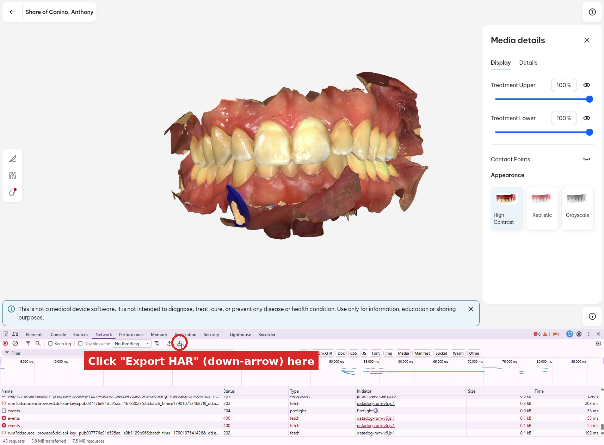
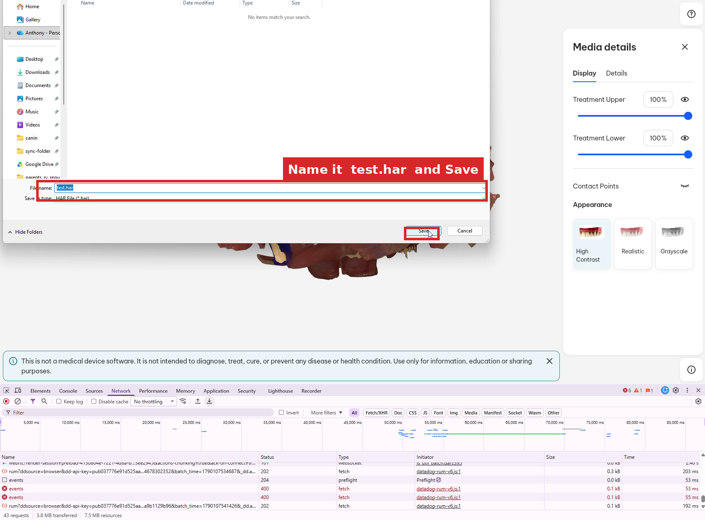

# DS Core Scan to STL

> Disclosure, this readme and script are AI generated, but I have successfully 3d printed my teeth using this tool

Convert Dentsply Sirona **DS Core** 3D scans into binary **STL** files.

When you view a shared scan on DS Core, the viewer downloads the model geometry as
`triangulation-proto` blobs (length-delimited protobuf messages containing vertices and
triangle indices). This tool captures those blobs from a browser **HAR** file and turns
them into STL meshes you can open in Blender, MeshLab, a slicer, etc.

There are no third-party dependencies — only the Python 3 standard library.

## Requirements

- Python 3.8+
- A browser (Chrome, Edge, or Firefox) with Developer Tools

## Quick start

```bash
# 1. Capture a .har while loading the shared scan in your browser (see below)
# 2. Convert every triangulation found in the capture to STL
python3 convert_triangulation.py test.har
```

Each blob is downloaded and written next to the HAR file as `<blob-name>.stl`.

---

## How to create the `.har` file

The primary workflow is to record a HAR capture **while opening the scan links you
received by email**. Follow these steps.

### 1. Open the share link and log in

Open the share link from your email. DS Core asks for the password that was sent with
the share. Enter it and click **Login**.



### 2. Open the shared scan

On the **Shared files** page, click the scan that was shared with you.



### 3. Open Developer Tools *before* the model loads

Press **F12** (or `Ctrl+Shift+I` / `Cmd+Option+I`) and switch to the **Network** tab.
Make sure the red recording dot is active and **`Keep log` is checked** so requests are
not cleared while the page navigates.

> Tip: open DevTools and start the Network recording *before* clicking the scan, so the
> `triangulationUrl` responses are captured too.

### 4. Let the model finish loading

The viewer shows **Loading Model…** while it streams the geometry. Wait until the 3D
model is fully displayed — the triangulation data arrives during this step.



### 5. Export the HAR

With the model loaded, click the **Export HAR** button (the down-arrow into a tray icon at
the right of the Network toolbar). Alternatively, right-click any request row and choose
**Save all as HAR with content**.



### 6. Save the capture

Name the file `test.har` (or anything ending in `.har`) and click **Save**.



---

## Convert

```bash
python3 convert_triangulation.py test.har
```

Example output:

```
test.har: found 4 triangulation URL(s)
  downloading bea2458e-c764-463e-b0ce-a36170bcf312 ...
    bea2458e-c764-463e-b0ce-a36170bcf312: 423741 vertices, 844238 triangles -> bea2458e-c764-463e-b0ce-a36170bcf312.stl
  downloading dafbac82-d9eb-4085-94eb-2c74100f9441 ...
    dafbac82-d9eb-4085-94eb-2c74100f9441: 506492 vertices, 1008813 triangles -> dafbac82-d9eb-4085-94eb-2c74100f9441.stl
  ...
```

You can also convert a raw blob directly (the file you already downloaded from a
`triangulationUrl`):

```bash
python3 convert_triangulation.py 65dcced1-e3f8-4cc1-a5ba-df8ced01ea4c
# -> 65dcced1-e3f8-4cc1-a5ba-df8ced01ea4c.stl
```

## Blob format

Each blob is a protobuf message:

| Field | Wire type | Contents |
|-------|-----------|----------|
| 1     | 2         | packed `float32`, interleaved `x y z` → vertices |
| 2     | 2         | packed `uint32` (varint) → triangle indices |

The converter rebuilds triangle normals and writes a standard binary STL.

## Troubleshooting

- **`no triangulationUrl entries found`** – The scan geometry was not fetched while the
  capture was recording. Re-capture with DevTools already open and recording, then load
  the model and export the HAR again.
- **`download failed`** – The `triangulationUrl` values are temporary signed links. If the
  share has expired, request a new link, otherwise just re-capture and convert promptly.
- **Model shows as a flat surface** – This is expected: the scan is a surface scan of the
  teeth, not a closed solid. It needs cleaning/thickening before 3D printing (e.g. in
  Blender).
